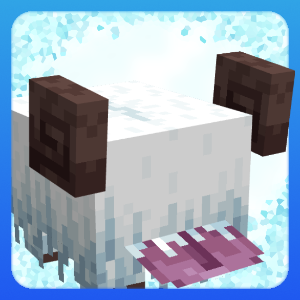
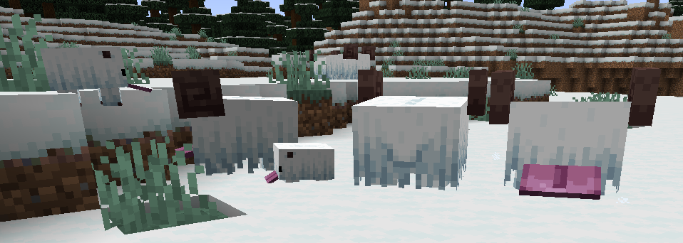
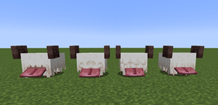
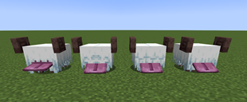

# Snuffles (Fabric)

This is the Unofficial Fabric version of [Snuffles](https://github.com/SnappyDragon64/Snuffles), licensed under [MIT](https://github.com/SnappyDragon64/Snuffles/blob/main/LICENSE.md), please support the original work!

Made during WinterJam 2021.

Snuffles are fluffy mobs with a big tongue found in snowy biomes with unique frosty fur. They can be bred with potatoes, they'll flap their tongues and run towards you if you're holding them. Their fur is covered with frost, which can removed with magma cream or fire. Frosty Snuffles leave a trail of snowflakes wherever they go. Their fluff can be harvested by shearing them, trimming the excess fluff and exposing their eyes.

If a Snuffle is warm, it can turn frosty again by being in the open when it is snowing or by walking into powder snow. This can be seen here.

Slimeballs can be used on them to cycle through 4 hairstyles.

Snuffle Fluff and Snuffle Fluff Carpets are decoration blocks and Frosty Fluff and Frosty Fluff Carpets make snowflakes when stepped on. Frosty Fluff also makes snowflake particles below it if there are no blocks under it.
